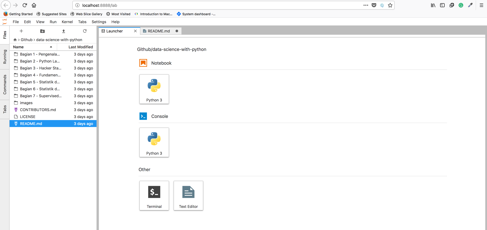
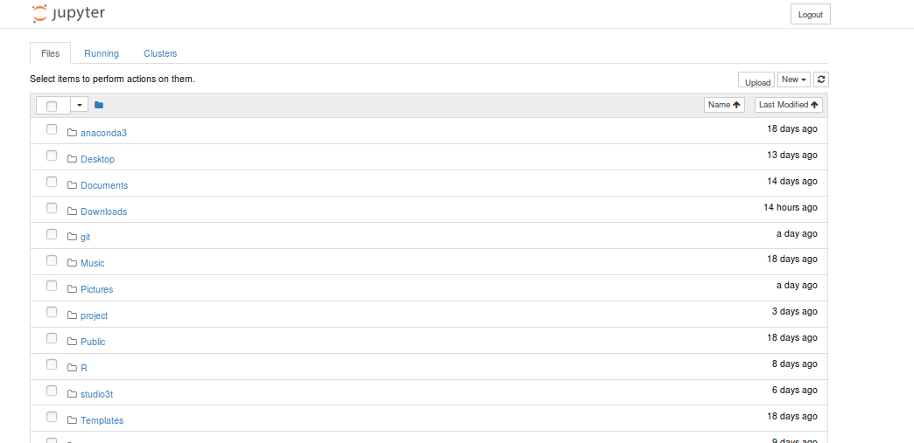

# Data Science With Python
> Belajar Data Science secara praktis menggunakan Python

## Pemasangan (Installation) dan Penggunaan Pertama 

Silahkan download [Anaconda](https://anaconda.com/download). Install sesuai dengan sistem operasi masing - masing. Setelah itu clone / download repositori ini ke folder kalian inginkan.

## Menggunakan Anaconda Navigator

- MacOS dan Linux:
   - Buka terminal, kemudian ketik

```sh
$ anaconda-navigator
```

- Windows:
    - Buka launcher windows, kemudian pilih program Anaconda Navigator

Tampilan Anaconda Navigator akan seperti ini.


Silahkan launch jupyter lab / jupyter notebook kemudian navigasi ke folder yang telah kalian simpan.

## Menggunakan Terminal atau Anaconda Prompt

- MacOS dan Linux:
   - Buka terminal, kemudian ketik

```sh
$ jupyter-lab
```

atau

```sh
$ jupyter notebook
```

- Windows:
   - Buka Anaconda Prompt, kemudian ketik

```sh
C:\> jupyter-lab    
```

atau

```sh
C:\> jupyter notebook   
```

Kemudian navigasi ke folder yang telah kalian simpan.

## Tampilan Jupyter-lab



## Tampilan Jupyter Notebook


## NLP Dataset 
- NLP dataset dapat diunduh [disini](https://drive.google.com/file/d/1IX9cWMwzc4v8lLivk19k2LV2JrCj0KD1/view?usp=sharing")
## Inspirasi

Materi repositori ini terinspirasi setelah saya menyelesaikan [Data Camp](https://datacamp.com)       Data Science Python Career Track. Semua data yang dipergunakan di repositori ini terdapat pada DataCamp. Silahkan kunjungi DataCamp karena merupakan tempat yang keren untuk memulai belajar Data Science.

## Lisensi

Didistribusikan menggunakan lisensi MIT. Silahkan melihat `` LICENSE `` untuk lebih lanjut

## Kontribusi
1. Silahkan di Fork  
2. Buat branch baru (`git checkout -b feature/fooBar`)
3. Silahkan isi nama anda beserta tautan github anda di CONTRIBUTORS.md
4. Commit perubahan yang ada(`git commit -am 'Add some fooBar'`)
5. Push pada branch yang sudah ada (`git push origin feature/fooBar`)
6. Buat sebuah Pull Request baru